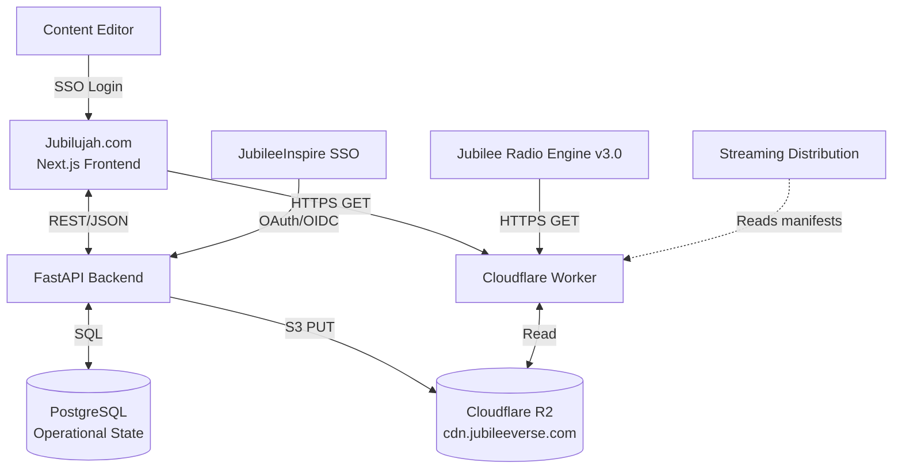

# Jubilujah.com — Build Specification

**Project:** Jubilujah.com
**Owner:** Gabriel Ungureanu, Jubilee Software, Inc.
**Status:** v1.0 Draft — Engineering Handoff Ready
**Last Updated:** June 3, 2026

---

## Table of Contents

1. [Purpose & Vision](#1-purpose--vision)
2. [System Goals](#2-system-goals)
3. [High-Level Architecture](#3-high-level-architecture)
4. [Technology Stack](#4-technology-stack)
5. [Authentication & Authorization](#5-authentication--authorization)
6. [Artist & Brand Taxonomy](#6-artist--brand-taxonomy)
7. [Catalog Domain Model](#7-catalog-domain-model)
8. [Production Pipeline](#8-production-pipeline)
9. [Polymorphic Ratings System](#9-polymorphic-ratings-system)
10. [Editorial Annotations & Comments](#10-editorial-annotations--comments)
11. [Awards & Nominations](#11-awards--nominations)
12. [Radio Programming](#12-radio-programming)
13. [Persistent Footer Player](#13-persistent-footer-player)
14. [Admin Dashboard](#14-admin-dashboard)
15. [CDN Architecture](#15-cdn-architecture-cdnjubileeversecom)
16. [JSON Manifest Schemas](#16-json-manifest-schemas)
17. [Publish Flow](#17-publish-flow)
18. [Database Schema (Initial DDL)](#18-database-schema-initial-ddl)
19. [API Surface (Initial)](#19-api-surface-initial)
20. [Non-Functional Requirements](#20-non-functional-requirements)
21. [Open Decisions](#21-open-decisions)
22. [Glossary](#22-glossary)

---

## 1. Purpose & Vision

Jubilujah.com is an internal, editor-gated catalog and operations console for managing every musical asset produced under the Jubilee Software, Inc. umbrella — across the Inspire Family persona ecosystem, affiliated artists, children's brands (Party Giggles, Tiny Tiggles), and other Jubilee initiatives.

It is **not** a public-facing listening platform. Public listeners access Jubilee music through:

- **Jubilee Radio** — the 101-station HM-band catalog (Icecast-KH / Liquidsoap engine)
- **Streaming distribution** — Spotify, Apple Music, YouTube Music, and other DSPs
- **Future consumer surfaces** that read directly from `cdn.jubileeverse.com`

Jubilujah is the **workshop**. The CDN is the **storefront**. Postgres holds the working state; the CDN holds the canonical published state.

---

## 2. System Goals

1. Manage the full lifecycle of every musical asset — from concept through distribution
2. Provide a unified catalog for all Jubilee artists, organized into distinct brand groupings (Inspire Family, Affiliated Artists, Children's Brands, Other Initiatives)
3. Track production pipeline state across all stages with full audit trail
4. Enable editorial collaboration — ratings, comments, nominations — on every catalog object
5. Serve as the source of truth for radio programming across all 101 Jubilee Radio stations
6. Publish canonical content manifests to `cdn.jubileeverse.com` for downstream consumers
7. Enforce Jubilee operational standards — the 12-song album lock for Inspire Family, the OHI default mode, the Hebrew article rule on lyrics — at the data layer

---

## 3. High-Level Architecture



Three distinct data planes:

- **Operational plane** — Postgres backing Jubilujah — holds editorial state: pipeline assignments, ratings, comments, nominations, audit logs. The workshop floor.
- **Canonical plane** — Cloudflare R2 mapped to `cdn.jubileeverse.com` — holds published JSON manifests and audio assets. The immutable record of "what is live" and the surface every downstream consumer reads from.
- **Identity plane** — JubileeInspire SSO (OAuth 2.0 / OIDC at `api.JubileeInspire.com`) — handles account lifecycle, role claims, and session management.

---

## 4. Technology Stack

### Frontend

- **Framework:** Next.js 14+ with App Router
- **Language:** TypeScript (strict mode)
- **Styling:** Tailwind CSS + shadcn/ui component primitives
- **State management:** Zustand (player, auth, notification stores)
- **Audio playback:** HTML5 `<audio>` element with Web Audio API where needed
- **Forms & validation:** React Hook Form + Zod
- **Data fetching:** TanStack Query (React Query)

### Backend

- **Framework:** FastAPI (Python 3.12+) with async support
- **ORM:** SQLAlchemy 2.0 (async) + Alembic for migrations
- **Background jobs:** APScheduler for periodic tasks; Celery + Redis if volume demands
- **Auth integration:** Authlib for OAuth/OIDC client flows
- **CDN client:** boto3 configured with Cloudflare R2 endpoint

### Data & Storage

- **Primary DB:** PostgreSQL 16+
- **Object storage:** Cloudflare R2 (S3-compatible)
- **CDN edge:** Cloudflare Workers in front of R2 — handles auth gating, range requests, cache headers, CORS
- **Cache (optional):** Redis for session cache and rate limiting

### Observability

- **Logging:** Structured JSON logs (`structlog`)
- **Tracing:** OpenTelemetry (vendor TBD)
- **Error tracking:** Sentry
- **Metrics:** Prometheus-compatible endpoint

### Hosting

- **Frontend:** Vercel or Cloudflare Pages
- **Backend:** Initially managed cloud (containerized); option to migrate to InspireCortex once stable
- **Database:** Managed Postgres (Neon, Supabase, or RDS) initially; self-hosted option later

---

## 5. Authentication & Authorization

### Single Sign-On

Authentication is delegated entirely to **JubileeInspire SSO** at `api.JubileeInspire.com` via OAuth 2.0 / OpenID Connect. Jubilujah does not manage passwords, MFA, or account lifecycle directly.

**Login flow:**

1. Unauthenticated user hits any Jubilujah route → redirect to `/auth/login`
2. `/auth/login` initiates OIDC Authorization Code flow with PKCE → redirect to JubileeInspire
3. User authenticates at JubileeInspire (may include MFA, Cloudflare Turnstile)
4. JubileeInspire redirects back with authorization code
5. Backend exchanges code for tokens, validates ID token signature, extracts claims
6. Backend issues session cookie (HttpOnly, Secure, SameSite=Strict)
7. User redirected to original destination

### Role-Based Access Control

A user must have a minimum role of **`content_editor`** to access any part of Jubilujah.

| Role                 | Permissions                                                                |
|----------------------|----------------------------------------------------------------------------|
| `viewer`             | Read-only catalog access (no edits, no ratings, no comments)               |
| `content_editor`     | Full CRUD on songs, albums, lyrics, metadata; rate; comment; nominate      |
| `radio_producer`     | Above + manage programs, playlists, station assignments                    |
| `production_manager` | Above + advance songs through pipeline stages; approve stage gates         |
| `admin`              | Above + manage users/roles; select award winners; trigger publishes        |

Roles are stored as claims on the JubileeInspire token (`roles: ["content_editor", "radio_producer"]`) and synced to a local `identity.user_roles` table on every login. Authorization middleware checks the local cache for sub-second decisions.

### Route gating

- All routes under `/` require valid session
- Routes under `/admin/*` require `admin` role
- API endpoints under `/api/admin/*` enforce admin-level role at middleware
- Audio assets for unpublished songs require a session-bound editor token (validated at the Worker — see §15)

---

## 6. Artist & Brand Taxonomy

Every artist or brand in the catalog belongs to exactly one of four groupings:

| Grouping              | Description                                                            | 12-Song Lock |
|-----------------------|------------------------------------------------------------------------|--------------|
| **Inspire Family**    | The 13 canonical personas (12 + Gabriel Inspire as apostolic covering) | ✅ Enforced  |
| **Affiliated Artists**| Non-Inspire-Family personas; other Jubilee Music projects              | Optional     |
| **Children's Brands** | Party Giggles, Tiny Tiggles, and future children's universes           | Optional     |
| **Other Initiatives** | One-off projects, experimental releases, special editions              | Optional     |

### Inspire Family Roster (Locked)

1. Jubilee Inspire
2. Melody Inspire
3. Zariah Inspire
4. Elias Inspire
5. Eliana Inspire *(never spelled "Ileana")*
6. Caleb Inspire
7. Imani Inspire
8. Zev Inspire
9. Amir Inspire
10. Nova Inspire
11. Santiago Inspire
12. Tahoma Inspire *(male)*
13. Gabriel Inspire *(apostolic covering tier)*

Each Inspire Family persona carries metadata for Five-Fold dual-office assignment, genre anchor, visual identity, and OHI/CCI mode default — all stored in their artist record and referenced throughout the catalog.

### Grouping UI

The catalog browse view organizes content by grouping, with each grouping rendered as a visually distinct section. Inspire Family takes the lead position; Affiliated Artists, Children's Brands, and Other Initiatives follow. Within each grouping, artists are listed alphabetically by default with sort options (recent activity, album count, average rating).

---

## 7. Catalog Domain Model

### Core entities

- **Artist** — a persona or branded act (any grouping). Carries display name, slug, grouping, bio, visual identity references, Five-Fold dual-office (where applicable), genre anchor.
- **Album** — a release belonging to one artist. Enforces 12-song lock for Inspire Family artists. Carries cover art reference, release date, language, genre tags, OHI/CCI internal label.
- **Song** — an individual track. Belongs to one album. Carries title (multilingual), duration, language(s), audio asset reference, lyrics, scripture references, metadata (ISRC, etc.).
- **Lyrics** — multilingual content tied to a song. Stored as plain text or LRC (timestamped) format. Includes scripture references and translation pairs.
- **Asset** — a file reference to audio on R2, cover art, or supporting media.

### Catalog rules enforced at the data layer

- Inspire Family albums must have exactly 12 songs to be eligible for publish (enforced via trigger at publish time)
- Lyrics text validators flag violations of the Hebrew article rule (no "the Ruach HaKodesh"; must be "the Ruach Kodesh" or "Ruach HaKodesh") for editorial correction
- OHI is the default content mode; CCI is an internal-only override flag, never serialized in published JSON manifests

See §18 for full DDL.

---

## 8. Production Pipeline

Every song flows through a 10-stage pipeline, refining the 7-step framework already in use across Jubilee production workflows.

| Stage              | Description                                              | Typical actor             |
|--------------------|----------------------------------------------------------|---------------------------|
| `concept`          | Song idea captured; no lyrics yet                        | Gabriel / Persona lead    |
| `lyrics_drafting`  | Lyrics being composed                                    | Gabriel / Melody          |
| `lyrics_approved`  | Lyrics finalized; ready for generation                   | Gabriel                   |
| `song_generation`  | Audio being generated via Suno.com                       | Music Engineer            |
| `qa_review`        | Generated audio under QA review                          | Tahoma Inspire (QA)       |
| `engineering`      | Mix / master / cleanup pass                              | Music Engineer            |
| `sunil_approval`   | Final asset verified before publish                      | Sunil Gemini              |
| `final_approval`   | Stewardship sign-off; ready for release                  | Gabriel Ungureanu         |
| `published`        | Live on `cdn.jubileeverse.com`; in catalog index         | (system on publish)       |
| `distributed`      | Submitted to streaming distribution partners             | (system / Cortex Flow)    |

### Stage transitions

Transitions are recorded in an **append-only** `production.pipeline_history` table. Every transition requires:

- The transitioning user (from session)
- Source stage (auto-filled from current state)
- Destination stage (required)
- Optional note (encouraged for backwards transitions)

Stages can move forward or backward, but each transition is logged. There is no destructive delete — only forward and reverse motion, both audited.

### Pipeline rules

- A song cannot reach `published` until all upstream stages have been completed
- An album cannot be `published` until all 12 (or N for non-Inspire) of its songs are `published`
- A song's `pipeline_state.current_stage` synchronizes its JSON manifest `status` field on the CDN

---

## 9. Polymorphic Ratings System

Every rateable object — **song, album, artist, playlist, program** — supports an independent 5-star rating from each Content Editor. One rating per editor per object; editors can update their rating but not double-vote.

### Schema

```sql
CREATE TYPE rateable_type AS ENUM (
  'song', 'album', 'artist', 'playlist', 'program'
);

CREATE TABLE production.ratings (
  id              UUID PRIMARY KEY DEFAULT gen_random_uuid(),
  rateable_type   rateable_type NOT NULL,
  rateable_id     UUID NOT NULL,
  rater_user_id   UUID NOT NULL REFERENCES identity.users(id),
  stars           SMALLINT NOT NULL CHECK (stars BETWEEN 1 AND 5),
  note            TEXT,
  created_at      TIMESTAMPTZ NOT NULL DEFAULT NOW(),
  updated_at      TIMESTAMPTZ NOT NULL DEFAULT NOW(),
  UNIQUE (rateable_type, rateable_id, rater_user_id)
);

CREATE INDEX idx_ratings_target
  ON production.ratings (rateable_type, rateable_id);
```

### Aggregation

Cumulative rating is `AVG(stars)` and `COUNT(*)` per `(rateable_type, rateable_id)`. For high-frequency reads, denormalize to the parent entity row via trigger:

```sql
ALTER TABLE catalog.songs
  ADD COLUMN avg_rating numeric(3,2) DEFAULT NULL,
  ADD COLUMN rating_count integer NOT NULL DEFAULT 0;
-- Repeat for catalog.albums, catalog.artists, radio.playlists, radio.programs
-- Trigger updates these on rating INSERT / UPDATE / DELETE
```

### UI

- Rating widget renders as 5 outline stars; hover shows fill preview; click commits
- Below the stars: `★ 4.2 (20 ratings)` with click expanding to the distribution histogram
- Distribution view lists every editor's rating with their note (full transparency — internal tool)
- Editor sees their own current rating highlighted; can click again to update

---

## 10. Editorial Annotations & Comments

Comments are tied to objects via the same polymorphic pattern as ratings. Features:

- Plain text body
- Threaded replies (one level deep — flat-with-replies, not deep nesting)
- @mentions of other editors (triggers in-app notification)
- Optional anchor to a lyric line number (when the object is a song with lyrics)
- Soft delete with edit history retention (last 5 edits)

### Schema

```sql
CREATE TABLE production.comments (
  id              UUID PRIMARY KEY DEFAULT gen_random_uuid(),
  rateable_type   rateable_type NOT NULL,
  rateable_id     UUID NOT NULL,
  author_user_id  UUID NOT NULL REFERENCES identity.users(id),
  parent_id       UUID REFERENCES production.comments(id),
  body            TEXT NOT NULL,
  lyric_line      INTEGER,                       -- nullable; only for song-anchored
  mentions        UUID[] NOT NULL DEFAULT '{}',  -- mentioned user IDs
  created_at      TIMESTAMPTZ NOT NULL DEFAULT NOW(),
  updated_at      TIMESTAMPTZ NOT NULL DEFAULT NOW(),
  deleted_at      TIMESTAMPTZ                    -- soft delete
);

CREATE INDEX idx_comments_target
  ON production.comments (rateable_type, rateable_id)
  WHERE deleted_at IS NULL;
```

Comments never appear in published JSON manifests — they are internal editorial only.

---

## 11. Awards & Nominations

### Scope

- **Nominate-able objects:** songs and albums only
- **Winner selection:** admin (Gabriel or designated admin role) selects from nominees; no auto-count winning
- **Cadence:** annual

### Nomination flow

1. Editor clicks 🏆 trophy icon on a song or album
2. Modal opens titled "Nominate for Award"
3. Editor selects category from currently-open list (filtered by object type)
4. Editor writes a justification — **minimum 250 characters after whitespace trim**, enforced both client-side (live counter, disabled submit) and server-side (Postgres CHECK constraint)
5. Submit → row inserted into `production.nominations`
6. Object displays a small trophy badge with nomination count

### Schema

```sql
CREATE TABLE production.award_categories (
  id              UUID PRIMARY KEY DEFAULT gen_random_uuid(),
  name            TEXT NOT NULL UNIQUE,
  description     TEXT,
  rateable_type   rateable_type NOT NULL
                  CHECK (rateable_type IN ('song', 'album')),
  active          BOOLEAN NOT NULL DEFAULT TRUE
);

CREATE TABLE production.award_periods (
  id              UUID PRIMARY KEY DEFAULT gen_random_uuid(),
  category_id     UUID NOT NULL REFERENCES production.award_categories(id),
  year            INTEGER NOT NULL,
  opens_at        TIMESTAMPTZ NOT NULL,
  closes_at       TIMESTAMPTZ NOT NULL,
  status          TEXT NOT NULL DEFAULT 'open'
                  CHECK (status IN ('open', 'closed', 'awarded')),
  UNIQUE (category_id, year)
);

CREATE TABLE production.nominations (
  id              UUID PRIMARY KEY DEFAULT gen_random_uuid(),
  period_id       UUID NOT NULL REFERENCES production.award_periods(id),
  rateable_type   rateable_type NOT NULL
                  CHECK (rateable_type IN ('song', 'album')),
  rateable_id     UUID NOT NULL,
  nominator_id    UUID NOT NULL REFERENCES identity.users(id),
  reason          TEXT NOT NULL,
  created_at      TIMESTAMPTZ NOT NULL DEFAULT NOW(),
  CONSTRAINT reason_min_length CHECK (length(trim(reason)) >= 250),
  UNIQUE (period_id, rateable_type, rateable_id, nominator_id)
);

CREATE TABLE production.awards (
  id              UUID PRIMARY KEY DEFAULT gen_random_uuid(),
  period_id       UUID NOT NULL REFERENCES production.award_periods(id),
  rateable_type   rateable_type NOT NULL,
  rateable_id     UUID NOT NULL,
  citation        TEXT,
  awarded_at      TIMESTAMPTZ NOT NULL DEFAULT NOW(),
  awarded_by      UUID NOT NULL REFERENCES identity.users(id),
  UNIQUE (period_id, rateable_type, rateable_id)
);
```

### Admin selection workflow

- After Dec 31 of the period year, admins see the **Nominees Review** dashboard per category
- Nominees listed sorted by nomination count (descending — signal only, not deciding factor)
- Each card expands to show: object preview, current rating, all nominators with full 250+ char justifications, inline play button, lyrics drawer
- Admin clicks **Award Winner**, writes citation, submits → period status → `awarded`
- Optional **Honorable Mention** action (distinct entry, runner-up recognition)

### Starter category catalog (editable in admin)

- Song of the Year
- Album of the Year
- Most Anointed Lyric
- Best Worship Anthem
- Best Prophetic Song
- Best Declaration Song
- Best Children's Song
- Best Children's Album
- Best Bilingual or Multilingual Production
- Best Cinematic Production
- Breakthrough Album of the Year

Categories are pure data — admins create, edit, or retire them.

### UI clarity

Since admins hand-pick winners, the nomination phase is **editorial signal**, not a vote. The trophy button is labeled "Nominate," and tooltips make clear that nomination is a recommendation for admin review — not a vote that auto-tallies.

---

## 12. Radio Programming

Jubilujah is the source of truth for **all** Jubilee Radio programming. The Jubilee Radio Engine v3.0 (Icecast-KH + Liquidsoap on Ubuntu 24.04 LTS) reads playlist manifests from `cdn.jubileeverse.com/radio/`.

### Entities

- **Station** — one of the 101 HM-band stations (HM 300–399.90)
- **Program** — a named show (e.g., "Morning Awakening with Eliana") tied to one or more stations, with a recurring schedule
- **Playlist** — an ordered collection of songs; can be standalone or attached to a program
- **Schedule** — daypart definitions per station (morning / midday / evening / overnight) with associated programs or playlists

### Schema (high-level)

```sql
CREATE SCHEMA radio;

CREATE TABLE radio.stations (
  id               UUID PRIMARY KEY DEFAULT gen_random_uuid(),
  call_sign        TEXT NOT NULL UNIQUE,         -- e.g., "HM 305.30"
  display_name     TEXT NOT NULL,
  frequency        NUMERIC(6,2) NOT NULL,
  genre_anchors    TEXT[] NOT NULL DEFAULT '{}',
  persona_affinity UUID[] NOT NULL DEFAULT '{}', -- preferred artist IDs
  is_active        BOOLEAN NOT NULL DEFAULT TRUE
);

CREATE TABLE radio.programs (
  id              UUID PRIMARY KEY DEFAULT gen_random_uuid(),
  name            TEXT NOT NULL,
  description     TEXT,
  host_artist_id  UUID REFERENCES catalog.artists(id),
  station_id      UUID REFERENCES radio.stations(id),
  schedule_cron   TEXT,                          -- cron expression for airing
  duration_min    INTEGER NOT NULL,
  is_active       BOOLEAN NOT NULL DEFAULT TRUE
);

CREATE TABLE radio.playlists (
  id              UUID PRIMARY KEY DEFAULT gen_random_uuid(),
  name            TEXT NOT NULL,
  description     TEXT,
  program_id      UUID REFERENCES radio.programs(id),  -- nullable; standalone OK
  created_by      UUID NOT NULL REFERENCES identity.users(id),
  created_at      TIMESTAMPTZ NOT NULL DEFAULT NOW(),
  updated_at      TIMESTAMPTZ NOT NULL DEFAULT NOW()
);

CREATE TABLE radio.playlist_items (
  id              UUID PRIMARY KEY DEFAULT gen_random_uuid(),
  playlist_id     UUID NOT NULL REFERENCES radio.playlists(id) ON DELETE CASCADE,
  song_id         UUID NOT NULL REFERENCES catalog.songs(id),
  position        INTEGER NOT NULL,
  transition      TEXT,                          -- "crossfade", "hard_cut", "sweeper"
  UNIQUE (playlist_id, position)
);
```

### Radio publish flow

When a playlist or program is updated and approved:

1. Jubilujah regenerates the canonical JSON manifest
2. Writes to `cdn.jubileeverse.com/radio/playlists/{id}.json` and `cdn.jubileeverse.com/radio/stations/{id}/lineup.json`
3. Cloudflare cache purge for affected paths
4. Radio Engine pulls fresh manifests on its next refresh cycle (or via webhook trigger)

---

## 13. Persistent Footer Player

A sticky audio player sits at the bottom of every Jubilujah page, persisting across navigation.

### Behavior

- Mounted in the root layout above the router so playback survives route changes
- Single `<audio>` element controlled by a global Zustand store
- Plays albums, playlists, or individual songs
- Continuous auto-advance: when the current source ends, the player rolls into the next album (by curator-defined or release-date order) or next playlist
- User can jump between playlists mid-stream — the queue replaces immediately on user action
- Loop modes: `off` / `repeat-one` / `repeat-source` / `repeat-all`

### Player state (Zustand store)

```typescript
interface PlayerState {
  // Current playback
  nowPlaying: Song | null;
  isPlaying: boolean;
  positionSec: number;
  durationSec: number;
  volume: number;          // 0.0 – 1.0

  // Queue
  upNext: Song[];
  history: Song[];
  source: { type: 'album' | 'playlist' | 'artist' | 'ad-hoc'; id: string } | null;

  // Modes
  loopMode: 'off' | 'one' | 'source' | 'all';

  // Actions
  play: (song: Song, source?: PlayerSource) => void;
  pause: () => void;
  resume: () => void;
  skipNext: () => void;
  skipPrev: () => void;
  seekTo: (seconds: number) => void;
  setVolume: (vol: number) => void;
  setLoopMode: (mode: LoopMode) => void;
  playSource: (source: PlayerSource) => void;  // replaces queue
}
```

### Features

- **Media Session API** integration → OS-level media keys, lockscreen controls, Bluetooth remote
- **Keyboard shortcuts** (when focus is outside text inputs):
  - `Space` = play/pause
  - `←` / `→` = seek
  - `↑` / `↓` = volume
  - `N` = next, `P` = previous
  - `M` = mute, `L` = cycle loop mode
- **Expandable now-playing overlay** with synced lyrics, ratings widget, comments link, trophy nomination button
- **Mini-player mode** collapsible to a single line for vertical space

### Source resolution

When user clicks play on an album or playlist:

1. Store fetches the source manifest from `cdn.jubileeverse.com`
2. Resolves song refs into a queue array
3. Sets `nowPlaying` to first item; `upNext` to the rest
4. On track end, advances to `upNext[0]`, pushes ended song to `history`
5. When `upNext` is empty, consults source context:
   - Album → fetch next album by same artist (release date)
   - Playlist → fetch next playlist in curator-defined sequence
   - Artist → fetch next song by same artist
6. Repeat as long as `loopMode !== 'off'`

---

## 14. Admin Dashboard

The `/admin` section is gated to `admin` role. It provides operational visibility across the entirety of Jubilujah.

### Overview page

- **Pipeline counters at the top:** *"23 songs awaiting Tahoma QA · 7 awaiting Sunil approval · 5 awaiting final approval · 2 ready to publish"*
- **Activity feed** (chronological) of every pipeline transition, rating, comment, nomination
- **Bottleneck alerts:** songs sitting in a stage longer than configured threshold (default 7 days)

### Pipeline Kanban

- Columns per pipeline stage
- Cards per song or album in flight
- Drag-to-advance with mandatory transition note for backward moves
- Filters: artist, grouping, stage, language, assignee, age
- Click card → detail drawer with full metadata, lyrics, audio play, comments, ratings, history

### Album Rollup

- Per album: visual progress bar against the 12-song lock (Inspire Family) or song count (other groupings)
- Stage breakdown: "9 published · 2 final_approval · 1 qa_review"
- Action button: **Publish album** (appears when all songs are `final_approval`)

### Awards Review

- Per period and category, list of nominees with full justifications
- Inline play for songs, cover preview for albums
- **Award Winner** / **Honorable Mention** / **Set Aside** actions

### Publish action

The **Publish to CDN** action is admin-only. See §17 for full flow.

### User & Role Management

- List users (synced from JubileeInspire), assign roles, view per-user activity
- Audit log of role changes

---

## 15. CDN Architecture (cdn.jubileeverse.com)

### Bucket layout

```
jubileeverse-cdn (R2 bucket → cdn.jubileeverse.com)
├── catalog/
│   ├── index.json                       # top-level manifest
│   ├── artists/
│   │   └── {artist-slug}.json
│   ├── albums/
│   │   └── {album-id}.json
│   ├── songs/
│   │   └── {song-id}.json
│   └── playlists/
│       └── {playlist-id}.json
├── radio/
│   ├── programs/
│   │   └── {program-id}.json
│   └── stations/
│       └── {station-id}/
│           └── lineup.json
├── audio/
│   └── {song-id}.mp3                    # or .flac, .wav
├── art/
│   ├── albums/
│   │   └── {album-id}/cover-{size}.webp
│   └── artists/
│       └── {artist-slug}/avatar-{size}.webp
└── schemas/
    └── v1/
        ├── song.schema.json
        ├── album.schema.json
        ├── artist.schema.json
        ├── playlist.schema.json
        └── program.schema.json
```

### Cloudflare Worker responsibilities

- **Public catalog reads** — fast pass-through with cache headers
- **Audio access gating** — status-based authorization
- **Range requests** — HTTP range support for audio scrubbing
- **CORS** — allow Jubilujah origin
- **Cache invalidation** — purge on publish writes

### Audio access gating

Pre-publish audio sits on the CDN (audio is uploaded at the `song_generation` Suno stage), but the Worker enforces authorization:

```javascript
async function handleAudio(request, env, key) {
  const songId = extractSongId(key);             // audio/abc123.mp3 → abc123
  const manifest = await env.CDN_BUCKET.get(`catalog/songs/${songId}.json`);
  if (!manifest) return new Response('Not found', { status: 404 });

  const { status } = JSON.parse(await manifest.text());

  if (status !== 'published') {
    // Require valid editor token for in-progress audio
    const token = request.headers.get('Authorization');
    if (!await verifyEditorToken(token, env)) {
      return new Response('Forbidden', { status: 403 });
    }
  }

  return serveAudioWithRange(env.CDN_BUCKET, key, request);
}
```

Published audio is publicly cacheable (TTL 24h+). Unpublished audio requires an editor session token signed by Jubilujah — Worker verifies signature against shared secret or JWT public key.

### Catalog index gating

`catalog/index.json` includes only objects with `status = 'published'`. The Worker serves it with short TTL (60s) and cache-purges on every publish.

### JSON file overwrite-in-place strategy

- One canonical path per object: `catalog/songs/abc123.json` is overwritten on every state change
- No version suffixes on the CDN
- Postgres `production.publications` table retains the version history with content hash for audit and rollback (regenerate from Postgres state if needed)

---

## 16. JSON Manifest Schemas

All JSON files on the CDN follow strict schemas. JSON Schema documents are published at `cdn.jubileeverse.com/schemas/v1/{type}.schema.json`.

### Song manifest example

```json
{
  "$schema": "https://cdn.jubileeverse.com/schemas/v1/song.schema.json",
  "id": "550e8400-e29b-41d4-a716-446655440000",
  "type": "song",
  "version": 3,
  "status": "published",
  "title": "Cântarea Miresei",
  "title_translations": {
    "en": "Song of the Bride"
  },
  "artist": {
    "id": "a1b2c3d4-...",
    "slug": "melody-inspire",
    "name": "Melody Inspire",
    "grouping": "inspire_family"
  },
  "album": {
    "id": "f1e2d3c4-...",
    "slug": "here-comes-the-bride",
    "track_number": 7
  },
  "duration_seconds": 247,
  "language": "ro",
  "language_secondary": ["en"],
  "genre_tags": ["worship", "bilingual", "bridal"],
  "five_fold_office": "prophet",
  "audio": {
    "primary_url": "https://cdn.jubileeverse.com/audio/550e8400-e29b-41d4-a716-446655440000.mp3",
    "format": "mp3",
    "bitrate_kbps": 320,
    "checksum_sha256": "e3b0c44298fc1c149afbf4c8996fb92427ae41e4649b934ca495991b7852b855"
  },
  "lyrics": {
    "format": "lrc",
    "content": "[00:00.00] ...",
    "translations": {
      "en": "..."
    },
    "scripture_refs": ["Isaiah 62:5", "Revelation 19:7"]
  },
  "metadata": {
    "isrc": "USABC2600001",
    "released_at": "2026-04-15T00:00:00Z",
    "first_published_at": "2026-04-15T00:00:00Z",
    "last_updated_at": "2026-05-22T14:23:11Z"
  },
  "awards": [
    {
      "category": "Most Anointed Lyric",
      "period": "2026",
      "type": "winner"
    }
  ]
}
```

### Album manifest (abbreviated)

```json
{
  "id": "f1e2d3c4-...",
  "type": "album",
  "status": "published",
  "title": "Here Comes the Bride",
  "artist": { "id": "...", "slug": "melody-inspire", "grouping": "inspire_family" },
  "cover_art": "https://cdn.jubileeverse.com/art/albums/.../cover-1200.webp",
  "songs": [
    { "id": "...", "track_number": 1, "title": "..." },
    { "id": "...", "track_number": 2, "title": "..." }
    // ... exactly 12 entries for Inspire Family
  ],
  "released_at": "2026-04-15T00:00:00Z",
  "language_primary": "ro",
  "languages": ["ro", "en"]
}
```

### Catalog index

`catalog/index.json` is a flat list of all published objects with minimum metadata for fast browsing:

```json
{
  "version": 1,
  "generated_at": "2026-06-03T18:00:00Z",
  "artists": [
    { "id": "...", "slug": "melody-inspire", "grouping": "inspire_family", "album_count": 3 }
  ],
  "albums": [
    { "id": "...", "artist_id": "...", "slug": "...", "track_count": 12, "released_at": "..." }
  ],
  "songs": [
    { "id": "...", "album_id": "...", "artist_id": "...", "title": "...", "duration_seconds": 247 }
  ]
}
```

OHI/CCI labels are **never** serialized to public JSON manifests. Editorial-only metadata (comments, ratings, internal notes) is likewise excluded.

---

## 17. Publish Flow

Publish action steps (admin-only):

```
1. Validate object (12-song lock, required fields, asset URL reachable)
2. Compose canonical JSON manifest from Postgres
3. Compute SHA-256 hash of serialized manifest
4. PUT manifest to R2 at canonical path (overwrites prior)
5. Purge Cloudflare edge cache for affected paths
6. Update catalog/index.json (if status changed from non-published to published)
7. INSERT into production.publications (version++, hash, by, at)
8. UPDATE production.pipeline_state SET current_stage = 'published'
9. INSERT into production.pipeline_history
10. COMMIT transaction; on any failure, rollback and surface error
```

All Postgres writes execute in a single transaction. The R2 PUT is idempotent — re-running the publish action is safe (same content produces same hash). Failed R2 PUTs queue for retry with exponential backoff.

### Album auto-promotion

When the 12th (or Nth) song of an album transitions to `published`, a trigger checks if all songs are published and, if so, auto-publishes the parent album manifest and adds it to the catalog index.

---

## 18. Database Schema (Initial DDL)

Four logical schemas:

- **`identity`** — users, roles, sessions, audit
- **`catalog`** — artists, albums, songs, lyrics, assets
- **`production`** — pipeline state, history, publications, ratings, comments, nominations, awards, periods, categories
- **`radio`** — stations, programs, playlists, playlist_items, schedules

Cross-schema foreign keys are used where appropriate (e.g., `production.ratings.rater_user_id → identity.users.id`).

A separate `schema.sql` artifact will be delivered alongside this spec containing the full DDL with constraints, indexes, triggers, and seed data for award categories, the Inspire Family roster, and the 101 stations.

---

## 19. API Surface (Initial)

REST endpoints, JSON request/response, session cookie auth (CSRF token for mutations).

### Catalog

- `GET    /api/artists` — list artists, filterable by grouping
- `GET    /api/artists/{id}`
- `POST   /api/artists`
- `PATCH  /api/artists/{id}`
- `GET    /api/albums?artist_id=...`
- `GET    /api/albums/{id}`
- `POST   /api/albums`
- `PATCH  /api/albums/{id}`
- `GET    /api/songs?album_id=...`
- `GET    /api/songs/{id}`
- `POST   /api/songs`
- `PATCH  /api/songs/{id}`
- `PUT    /api/songs/{id}/lyrics`

### Pipeline

- `GET    /api/pipeline?stage=...`
- `POST   /api/pipeline/{type}/{id}/transition`  — body: `{ to_stage, note }`

### Ratings

- `GET    /api/ratings/{type}/{id}` — aggregate + distribution
- `PUT    /api/ratings/{type}/{id}` — current user's rating (upsert)
- `DELETE /api/ratings/{type}/{id}` — current user removes their rating

### Comments

- `GET    /api/comments/{type}/{id}`
- `POST   /api/comments/{type}/{id}`
- `PATCH  /api/comments/{commentId}`
- `DELETE /api/comments/{commentId}` — soft delete

### Awards

- `GET    /api/awards/categories`
- `GET    /api/awards/periods/{year}`
- `POST   /api/awards/nominations` — body: `{ period_id, type, id, reason }`
- `GET    /api/awards/nominations?period={year}&category={id}`
- `POST   /api/admin/awards/winners` — admin only

### Radio

- `GET    /api/stations`
- `GET    /api/programs`
- `GET    /api/playlists`
- `POST   /api/playlists`
- `PATCH  /api/playlists/{id}/items`  — reorder, add, remove

### Admin

- `POST   /api/admin/publish/{type}/{id}` — trigger CDN publish
- `GET    /api/admin/users`
- `PATCH  /api/admin/users/{id}/roles`
- `GET    /api/admin/audit?since=...`

A full OpenAPI 3.1 specification will be generated from FastAPI route definitions and published at `/api/openapi.json`.

---

## 20. Non-Functional Requirements

### Performance

- Catalog browse pages render p95 < 500ms
- Pipeline dashboard renders p95 < 1s with up to 1,000 in-flight songs
- Audio playback start latency < 1s on warm cache
- Publish action completes p95 < 5s end-to-end

### Security

- All connections HTTPS only; HSTS enabled
- Session cookies HttpOnly, Secure, SameSite=Strict
- CSRF tokens on all state-changing requests
- Rate limiting on auth and write endpoints (Cloudflare layer)
- Input validation via Pydantic models on the backend
- SQL parameterized exclusively — no string interpolation
- Audit log retention: 7 years minimum

### Reliability

- Postgres daily logical backups + point-in-time recovery
- R2 bucket versioning for accidental overwrite recovery (separate from app-level versioning)
- Health check endpoints for all services
- Graceful degradation: if R2 publish fails, Postgres state remains consistent and operation is queued for retry

### Observability

- Structured logs for every request (correlation ID, user, route, latency, status)
- Trace key flows: login, publish, pipeline transition, rating change
- Alerts on publish failures, auth failure spikes, pipeline bottleneck thresholds

### Compliance & operational standards

- OHI/CCI internal labels never serialized to public JSON manifests
- Editorial content (comments, ratings, nominations) never reaches the CDN
- Personal data minimization: store only what's needed; reference JubileeInspire for canonical user data
- Hebrew article rule enforced via lyrics validation

---

## 21. Open Decisions

Items to resolve before or during implementation:

1. **Hosting target** — managed cloud (Vercel + managed Postgres) for v1, or self-hosted on InspireCortex once stable
2. **Background job framework** — APScheduler vs. Celery + Redis
3. **Mobile / PWA support** — is offline listening a goal for traveling editors?
4. **Suno integration** — direct API integration for triggering generation from Jubilujah, or manual upload of generated assets
5. **Streaming distribution handoff** — does Jubilujah push to DSPs, or hand off to a third-party aggregator (DistroKid, etc.)?
6. **Cortex Flow integration** — how tightly does the Jubilujah pipeline integrate with the existing Cortex Flow release state machine?
7. **Email / notification provider** — for @mentions, pipeline assignments, award nominations awaiting review
8. **Image asset pipeline** — cover art generation, multiple sizes, optimization, automation

---

## 22. Glossary

| Term                          | Definition                                                                                       |
|-------------------------------|--------------------------------------------------------------------------------------------------|
| Inspire Family                | The locked roster of 13 personas representing the apostolic-prophetic Jubilee musical brand       |
| OHI                           | Default content mode — internal label, never reader-facing                                        |
| CCI                           | Override content mode — internal flag, never appears in reader-facing output                       |
| 12-song lock                  | Operational standard requiring every Inspire Family album to contain exactly 12 songs             |
| Five-Fold dual-office         | Each Inspire Family persona's assignment within the Five-Fold ministry typology                   |
| HM-band                       | Proprietary radio frequency band 300–399.90 used by Jubilee Radio                                 |
| Hebrew article rule           | Lyrics convention: never "the Ruach HaKodesh"; use "the Ruach Kodesh" or "Ruach HaKodesh"         |
| Cortex Flow                   | Existing release state machine for Jubilee content workflows                                      |
| Sunil Gemini                  | CDN content manager responsible for pre-publish asset verification                                |
| Rateable object               | Any object supporting the polymorphic rating/comment/nomination pattern (song, album, etc.)        |

---

**End of Specification — v1.0**

For follow-up artifacts — full Postgres DDL (`schema.sql`), JSON Schema files, OpenAPI specification, or section refinements — see Gabriel Ungureanu.
